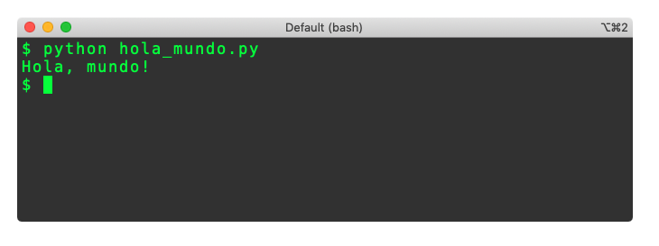
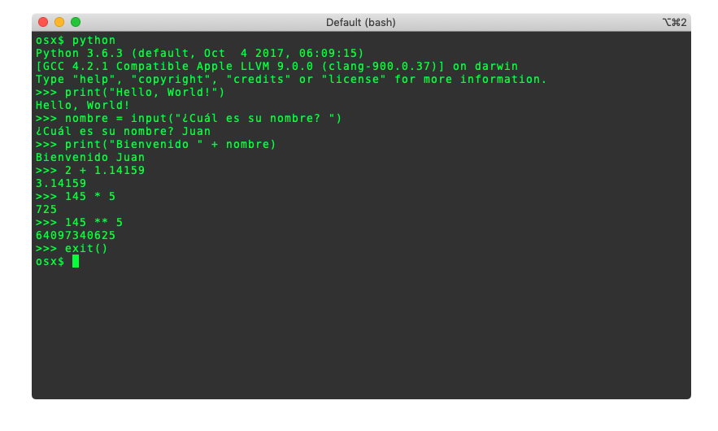
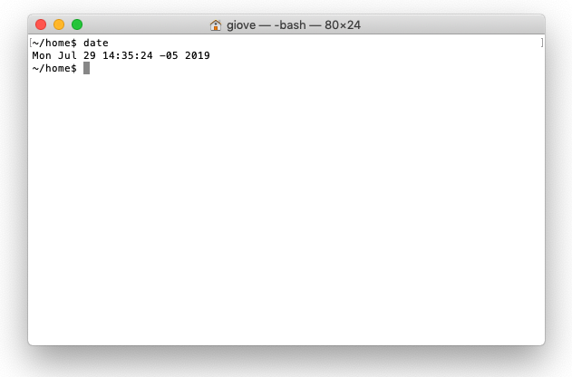

Versión borrador / preliminar |
-------------------|
Este documento es una versión preliminar para uso interno. Si encuentra algún problema o error, o si tiene algún comentario por favor repórtelo a los autores|


# Ambiente básico de trabajo

Para escribir programas es necesario utilizar unas herramientas que pueden variar dependiendo del lenguaje de programación. Incluso, para el mismo lenguaje es normal que existan muchas alternativas: no es necesario conocerlas todas, pero sí es importante poder utilizar al menos una con destreza.

En el caso de Python, lo usual es que se utilicen los siguientes elementos.


## IDE - Integrated Development Environment


Un ambiente integrado de desarrollo es un programa que integra muchas herramientas que se requieren para programar con facilidad. El elemento más importante de un IDE es un editor enriquecido para el lenguaje, que es capaz de marcar errores de sintaxis y que utilice colores, entre otras ayudas, para facilitar la comprensión del código. Otras herramientas que se encuentran usualmente en un IDE son un depurador (para seguir la traza de una ejecución), un explorador de archivos y un mecanismo para ejecutar los programas con facilidad.

En este libro utilizaremos un IDE para Python llamado Spyder que, aunque no es el IDE más poderoso disponible, tiene muchas características que lo hacen propicio para aprender a programar:
 
* Es sencillo. Comparado con otros IDEs, ofrece menos opciones, pero esto hace que un desarrollador sin experiencia no se pierda en medio de muchas opciones que no sabría utilizar.
* Ayuda al desarrollo, pero no demasiado. Otros IDEs tienen muchos más mecanismos automatizados que sugieren o incluso cambian cosas a medida que el desarrollador va trabajando. Aunque esto es muy útil para desarrolladores experimentados, hemos visto que a los estudiantes les da una falsa sensación de que saben lo que están haciendo, cuando en realidad es el IDE el que los está guiando. El resultado de esto es que después no logran explicar lo que hicieron o no logran utilizar otra herramienta que los ayude de forma diferente.
* Multiplataforma. Está disponible para todas las plataformas principales (Windows, Linux, Mac)
* No usa formatos propietarios. Lo que se desarrolle en Spyder se puede llevar a otra herramienta sin ningún problema.
* Es gratuito y fácil de instalar.


## Intérprete



Python es un lenguaje interpretado [^interpretado]: esto significa que para correr los programas escritos en Python es necesario que otro programa llamado intérprete los ejecute. En la imagen anterior se puede ver que se corrió un programa que se escribió en el archivo ```hola_mundo.py``` usando el intérprete de Python.

[^interpretado]: Python, al igual que otros lenguajes como Java, es realmente un lenguaje compilado e interpretado. Más aún, dependiendo de la implementación que se use, podría ser que los programas efectivamente se compilen y que no haya interpretación. Por simplicidad, en este libro hablaremos del intérprete de Python, sin entrar en detalles sobre el proceso de compilación.

Cada lenguaje de programación interpretado tiene su propio intérprete, e incluso puede haber varios intérpretes diferentes para el mismo lenguaje. En este libro vamos a suponer que usted está usando el intérprete básico, pero para Python hay varios adicionales que tienen características especiales como ser más rápidos, o requerir menos memoria, o incluso correr en plataformas especiales como plataformas de prototipado electrónico (ej. ESP8266 y ESP32) [^JS].

[^JS]: Otro ejemplo es el lenguaje JavaScript, para el que diferentes compañías han construido sus propios intérpretes: SpiderMonkey para Mozilla Firefox, V8 para Google Chrome, JavaScriptCore para Safari, Chakra para Microsoft Edge y Hermes para aplicaciones Android basadas en React Native.


## REPL para Python



Como en el caso de otros lenguajes interpretados, Python ofrece una herramienta de tipo **REPL**, la cual permite que un usuario interactúe con el lenguaje y vaya ejecutando instrucciones una por una. La sigla REPL hace referencia al orden en el que se van realizando las operaciones:

* **Read**. En primer lugar, la herramienta lee lo que escribió el usuario y le informa si hay algún error.
* **Evaluate**. Luego, la herramienta evalúa lo que escribió el usuario usando el intérprete del lenguaje. Esto quiere decir que en este punto se ejecuta lo que el usuario haya escrito.
* **Print**. Se imprime en la herramienta el resultado de la ejecución para que el usuario lo pueda leer.
* **Loop**. Se repite el proceso completo.

En la imagen anterior se demuestra el uso del REPL de Python con varios ciclos de ejecución. Cada vez que aparecen los caracteres ```>>>``` se le pidió al usuario que ingresara un comando. Lo que aparece en la siguiente línea es el resultado de cada una de las ejecuciones.

Para acceder al REPL de Python hay dos opciones básicas:

1. Ejecutar el comando ```python``` desde la línea de comandos o el terminal (ver siguiente sección).
2. Usar el IDE. En el caso de Spyder, hay una ventana con el título 'IPython Console' que nos permite interactuar directamente con el REPL.

**Actividades:**

1. Abra el REPL en su computador, copie las instrucciones del ejemplo y revise que el resultado sea similar.
2. Evalúe en el REPL la instrucción ```10/3```. ¿Qué piensa del resultado? ¿Es el que usted esperaba?
3. Escriba la instrucción que convierta 15 grados Celsius al equivalente en grados Fahrenheit. Recuerde que cada grado Fahrenheit equivale a 5 novenos de un grado Celsius y que la escala está desplazada 32 grados. Ayuda: 0 grados Celsius equivalen a -32 grados Fahrenheit, 37.5 (la temperatura aproximada de un cuerpo humano) equivalen a 99.5, y 15 grados Celsius equivalen a 59 grados Fahrenheit.


## Línea de comandos / terminal / consola

La última herramienta que probablemente tenga que usar cuando esté programando es la línea de comandos del sistema operativo. Esto también se conoce como la terminal o la consola y es un ambiente *no gráfico* interactivo que le permite ejecutar comandos directamente sobre el sistema operativo. Entre otras muchas opciones, desde la línea de comandos usted puede ejecutar programas, trabajar con el sistema de archivos (crear, renombrar, mover, eliminar y hasta editar archivos) y utilizar una gran cantidad de utilidades.

Para los que nunca la han utilizado, usar la línea de comandos suele parecer incómodo y difícil. La realidad es que su uso eficiente requiere un tiempo de práctica, pero después termina siendo mucho más rápido para hacer ciertas tareas que utilizar un ambiente gráfico y el mouse. Por ejemplo, imagine que en una carpeta suya hubiera una colección de 500 fotos y que usted quisiera tener versiones reducidas de esas imágenes (*previews*, *thumbnails*). Normalmente a usted le tomaría una buena cantidad de clics abrir cada una de esas fotos y cambiarle el tamaño. Desde la línea de comandos de OS X usted simplemente puede usar el comando ```sips -Z 120 *.png``` y realizar la operación sobre todas las imágenes.

El objetivo de esta sección no es explicar en detalle el funcionamiento de la línea de comandos de cada sistema operativo, sino mostrarle que existen e invitarlo para que estudie por su cuenta su funcionamiento.

En Windows, la línea de comandos se invoca corriendo el programa ```cmd```.


En OS X, la línea de comandos se invoca corriendo el programa ```Terminal```.


En Linux, la línea de comandos suele estar corriendo todo el tiempo, pero dependiendo de la distribución que esté usando se llega a ella de formas diferentes.

#### Notas


