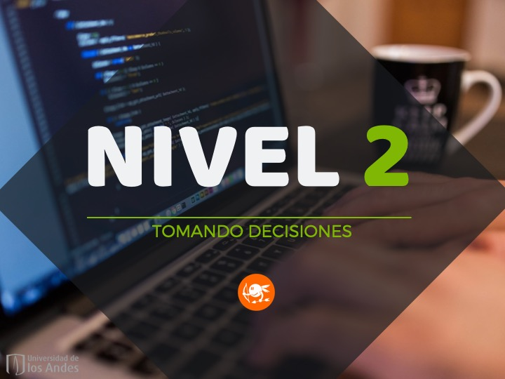

Versión borrador / preliminar |
-------------------|
Este documento es una versión preliminar para uso interno. Si encuentra algún problema o error, o si tiene algún comentario por favor repórtelo a los autores|

# Nivel 2: Tomando decisiones

En este nivel se presentan los conceptos necesarios para que un programa no siempre se ejecute de la misma manera, sino que pueda tomar decisiones dependiendo de las condiciones en que se ejecute y de los datos que proporcione el usuario. 

Los conceptos principales que se estudian en este nivel son los siguientes:

* Valores de verdad (booleanos)
* Instrucciones condicionales
* Diccionarios
* Paso de parámetros por valor y por referencia
* Módulos adicionales

